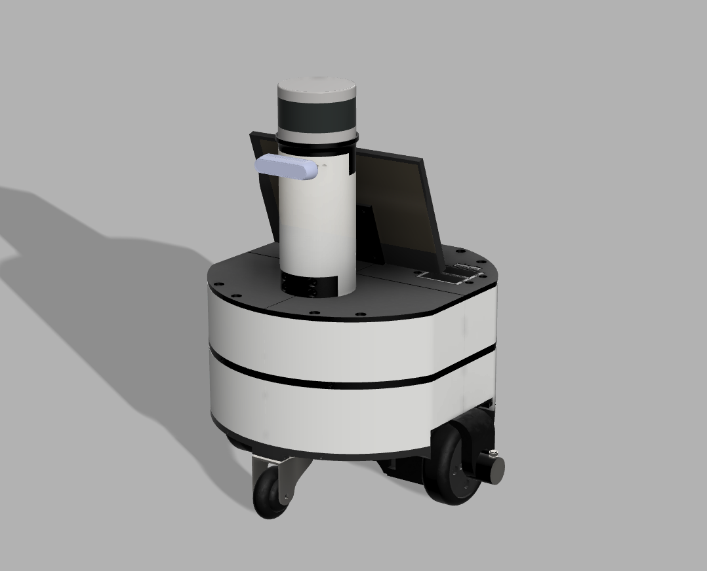
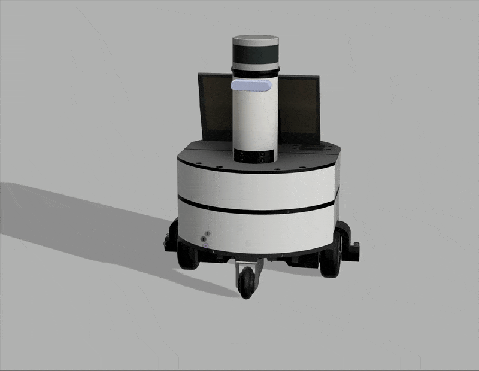

# 🤖 DiffDriveRobot  


## 🧭 Overview
**DiffDriveRobot** is the first open-source platform in the *Project Gradus* series,  
implementing a fundamental **two-wheel differential-drive** structure.  

<div align="center">
  
  
  <p><em>▲ Figure 1. Front and side views of the DiffDriveRobot prototype</em></p>
</div>

---

## 🚀 Future Development  

This section tracks the ongoing and upcoming development stages of **DiffDriveRobot**.  
Each item will be updated with relevant commits and documentation as progress is made.  

### 📁 Hardware & Design
- [X] Upload full CAD and STL design files  
- [ ] Complete commercial parts list under `hardware/assembly/`  

### ⚙️ Control System
- [ ] Upload **microcontroller code** (ESP32 firmware)  
- [ ] Upload **ROS 2 bring-up code** (communication nodes & launch files)  

### 🧠 Simulation & Navigation
- [ ] Upload **Gazebo simulation environment** (URDF, world, and launch)  
- [ ] Integrate **Nav2 (Navigation2)** stack for autonomous navigation  
- [ ] Validate navigation stack with odometry and LiDAR data  

### 🧩 Documentation
- [ ] Add wiring diagrams and connection guide in `hardware/assembly/`  
- [ ] Add usage examples for real-world and simulation setups  


---

## 📁 Directory Description

| Folder                          | Description                                                             |
| ------------------------------- | ----------------------------------------------------------------------- |
| **`hardware/design/`**          | Original CAD models and 3D-printable STL files                          |
| **`hardware/assembly/`**        | Assembly guide, wiring diagrams, and commercial parts list              |
| **`hardware/microcontroller/`** | ESP32 / micro-ROS firmware for motor control and encoder handling       |
| **`hardware/bringup/`**         | ROS 2 bring-up scripts and nodes for `/cmd_vel` ↔ `/odom` communication |
| **`simulation/`**               | Gazebo setup for virtual testing                                        |
| **`images/`**                   | Visual resources used in README or documentation                        |
| **`docs/`**                     | Technical notes, system diagrams, and development records               |

> 💡 The `hardware/` directory unifies every step of real-world implementation —
> from **design → assembly → microcontroller → ROS 2 bring-up** —
> ensuring reproducibility and modular hardware development.

---

## ⚙️ Key Features

* 🧩 **ROS 2 Integration:** Fully compatible with ROS 2 Humble and later
* 🧠 **Odometry / Encoder Support:** Real-time velocity and pose estimation
* 🎮 **Velocity Control Interface:** `/cmd_vel` topic for teleop and autonomous control
* 🪶 **Lightweight 3D-Printed Chassis:** Low-cost, easily modifiable body

  * The list of commercial off-the-shelf parts is available under **[Hardware → Assembly](#-commercial-parts-list)**
* 🧱 **Gazebo Simulation Environment:** URDF + world files provided

---

## 🧪 Simulation & Real-World Operation

### 🔹 Real-World Setup

**ESP32 (MCU)**

* Publishes `/odom` topic → encoder-based odometry data
* Subscribes to `/cmd_vel` → velocity commands from workstation

**Laptop / Workstation**

* Publishes `/cmd_vel` → drives the robot
* Subscribes to `/odom` → receives pose feedback for control and visualization

> ⚙️ Firmware under `hardware/microcontroller/` handles the real-time control logic,
> while `hardware/bringup/` contains the ROS 2 nodes and launch files used to operate the robot.

---

### 🔹 Gazebo Simulation (Coming Soon)

Run the robot in Gazebo with:

```bash
ros2 launch diffdrive_robot simulation.launch.py
```

Keyboard teleoperation example:

```bash
ros2 run teleop_twist_keyboard teleop_twist_keyboard /cmd_vel:=/cmd_vel
```

---

## 🛠️ Commercial Parts List

*(to be detailed in `hardware/assembly/`)*

| Component | Model / Link | Description |
|:--|:--|:--|
| **BLDC Motor** | TBD | 3 N·m torque|
| **Encoder** | TBD | Wheel rotation feedback for odometry |
| **Motor Driver** | TB6612 / L298N | BLDC control |
| **Battery** | TBD | 24 V · 20 Ah LiFePO₄ battery pack |
| **Caster Wheel** | TBD | Front and rear stabilizer wheels |
| **LiDAR** | Velodyne VLP-16 | 16-channel 3D LiDAR sensor for environment perception |
| **Camera** | Intel RealSense D435i | RGB-D camera for visual sensing |
| **MCU** | ESP32 | Microcontroller|
| **SBC** | Jetson Orin NX | Single-board computer|
| **IMU** | TBD | -- |


> 🧩 *This list is under continuous update.*

---


## 📜 License
> This project follows an open-source philosophy. All resources are freely available for research and educational use. (Specific license details can be found in the `LICENSE` file.)
---

